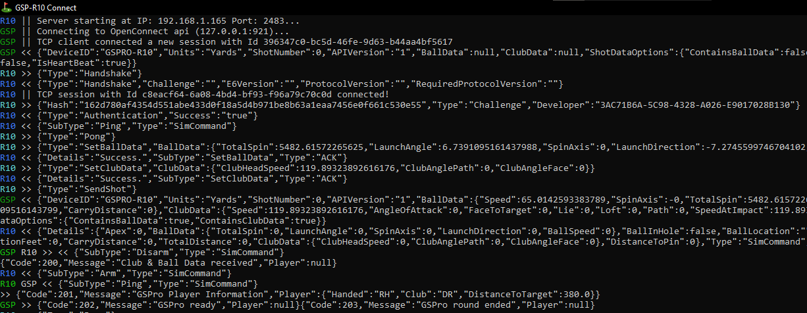

# gsp-r10-adapter

Utility to bridge R10 launch monitor to GSPro. Starts an "E6 Connect" compatible server and translates the messages into GSPro OpenConnect format.

Heavily inspired by this project https://github.com/travislang/gspro-garmin-connect-v2. 

The goal of this project was to provide an ultra lightweight alterntive to the current offering, with a focus on API transparency.

## Running

### From release

- Download either the standalone or net6 package from the release page. Extract zip to your local machine and run the exe file.
  - Use the standalone package if you are unsure whether your computer has a dotnet runtime installed
  - Use the net6 package if you believe your computer has a dotnet runtime installed.

### From Source

- Install a dotnet 6 sdk if you don't have one already
- `dotnet run` from project directory