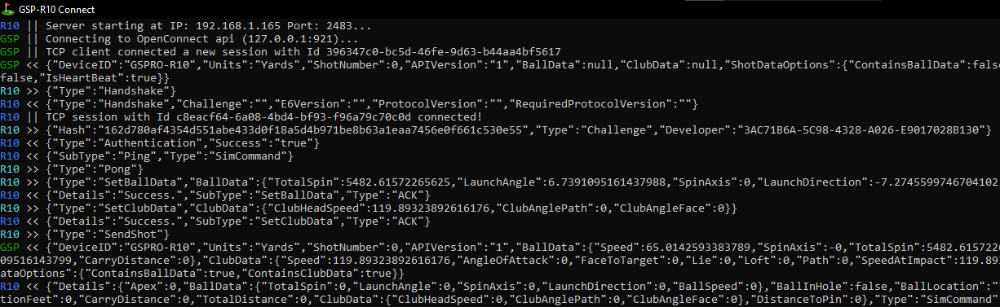

# gsp-r10-adapter

Utility to bridge R10 launch monitor to GSPro. Supports the following
  - An "E6 Connect" compatible server for use with the Launch Monitor's E6 integration
  - Direct bluetooth connection to R10
  - Webcam putting integration with https://github.com/alleexx/cam-putting-py

The goal of this project was to provide an ultra lightweight alterntive to the current offerings, with a focus on API transparency.

## Using Direct Bluetooth Connector

In order to use the direct bluetooth connection to the R10 you must
- Enable bluetooth in `settings.json` file
- Edit `settings.json` to reflect your desired altitude, tee distance, temperature, etc.
- Set device in pairing mode (blue blinking light) by holding power button for few seconds
- **Pair the R10 from the windows bluetooth settings**
  - On windows 11 you may need to set "Bluetooth Device Discovery" to `advanced`
  - This step only needs to be done once
  - You may need to disable bluetooth on previously paired devices to prevent them from stealing the connection

## Using the putting integration

In order to use the putting integration you must
- Enable putting in `settings.json` file
- Download ball_tracking software from https://github.com/alleexx/cam-putting-py/releases
  - If you want this program to manage opening/closing of putting camera, place ball_tracking in same folder as this program
- Read https://github.com/alleexx/cam-putting-py for webcam setup/troubleshooting
- Read putting section `settings.json` file to determine optimal settings for your setup
  - 

## Running

### From release

- Download either the standalone or net6 package from the release page. Extract zip to your local machine and run the exe file.
  - Use the standalone package if you are unsure whether your computer has a dotnet runtime installed
  - Use the net6 package if you believe your computer has a dotnet runtime installed.

### From Source

- Install a dotnet 7 sdk if you don't have one already
- `dotnet run` from project directory